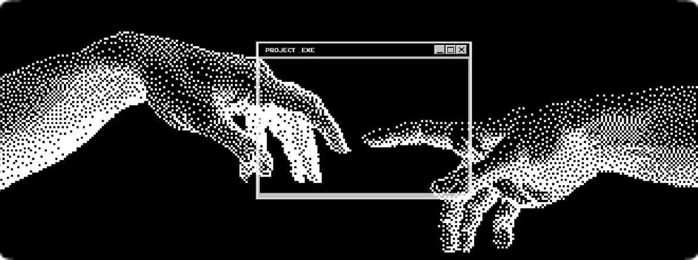

<!-- Reemplaza esta imagen por tu propia ilustración/banner -->

<h3 align="center">Hola 👋, soy Miguel</h3>

<h4 align="center">Desarrollador FullStack</h4>

 
   

  Construyendo sistemas robustos con arquitectura limpia y soluciones escalables.

---

## 🚀 Sobre mí

<table>
<tr>
<td valign="top" width="60%">

Soy **Miguel**, conocido en la red como **XanKeeTee** — actualmente estudiando el ciclo de **Desarrollo de Aplicaciones Multiplataforma (DAM)**, tras haber completado ya **Desarrollo de Aplicaciones Web (DAW)**.

Me gusta construir aplicaciones y APIs escalables, y sigo mejorando mi comprensión de sistemas reales tanto en frontend como en backend.

Mi objetivo es simple: escribir código limpio, construir software fiable y crecer como desarrollador que crea sistemas que perduran.

</td>
<td valign="top" width="40%" align="center">

<!-- Reemplaza esta imagen por tu propia ilustración -->

</td>
</tr>
</table>

---

## 🤝 Conecta conmigo

  
  
  

---

## 💻 Tech Stack

  

  

---

## 📊 Estadísticas de GitHub

  
  

<!-- Si la de arriba no carga (la demo pública a veces se satura), prueba este mirror en su lugar:

-->

---

## 📈 Gráfico de actividad

  

<!-- Si no carga, prueba este mirror alternativo de la comunidad:

-->
